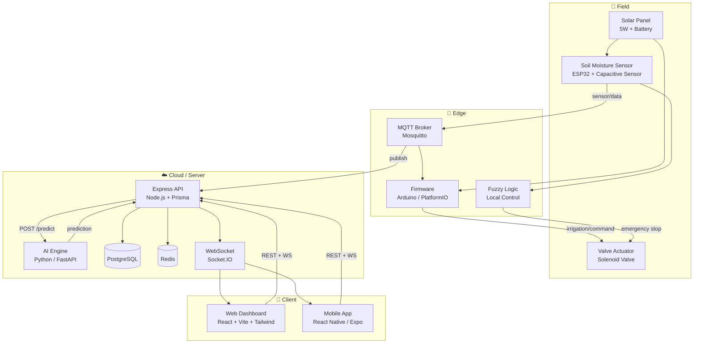
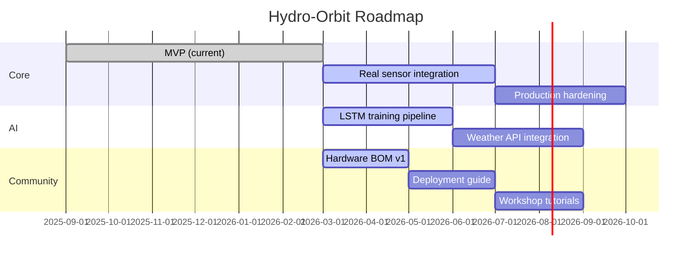

<p align="center">
  
</p>

<h1 align="center">Hydro‑Orbit</h1>
<p align="center">
  <em>Solar‑powered, AI‑driven smart irrigation for smallholder farmers.</em>
</p>

<p align="center">
  <a href="LICENSE"></a>
  <a href="https://github.com/kawacukennedy/hydro_orbit/actions"></a>
  <a href="https://github.com/kawacukennedy/hydro_orbit/releases"></a>
  <a href="https://github.com/kawacukennedy/hydro_orbit/stargazers"></a>
  <a href="https://github.com/kawacukennedy/hydro_orbit/blob/main/CODE_OF_CONDUCT.md"></a>
</p>

<p align="center">
  <a href="#-why-hydro-orbit">Why?</a> •
  <a href="#-key-features">Features</a> •
  <a href="#-architecture">Architecture</a> •
  <a href="#-quick-start">Quick Start</a> •
  <a href="#-tech-stack">Tech Stack</a> •
  <a href="#-roadmap">Roadmap</a> •
  <a href="#-contributing">Contributing</a>
</p>

<br />

---

**Hydro‑Orbit** is a complete, open‑source smart irrigation platform built for smallholder farmers in water‑stressed regions. It combines **ESP32‑based soil sensors**, a **fuzzy‑logic AI engine**, a **real‑time web dashboard**, and a **mobile app** to deliver precise, automated irrigation — all powered by solar energy and designed for off‑grid deployment.

Unlike closed commercial systems, Hydro‑Orbit gives you full control: modify the firmware, train your own AI models, build custom dashboards, or deploy the entire stack on a Raspberry Pi.

---

## Why Hydro‑Orbit?

In Rwanda, **only 27–31% of irrigable land receives adequate water**. Smallholder farmers — who produce 80% of the country's food — rely on rain‑fed agriculture that is increasingly unreliable due to climate change. Commercial irrigation systems are expensive, proprietary, and designed for large industrial farms.

Hydro‑Orbit was built to change that:

| Problem | Our Solution |
|---------|-------------|
| Expensive proprietary hardware | **Open‑source ESP32 + sensors** — ~$50 per node |
| Complex installation | **Solar‑powered, wireless** — works off‑grid |
| No real‑time visibility | **Web + mobile dashboard** with live sensor data |
| Wasted water | **AI‑driven scheduling** reduces usage by up to 31% |
| One‑size‑fits-all | **Configurable zones** for different crops and soil types |

**What makes Hydro‑Orbit different?**

- **Fully open source** — hardware, firmware, backend, AI, and frontend
- **Greywater‑ready** — designed to safely integrate treated household greywater
- **Solar‑native** — low‑power ESP32 with solar charging
- **AI at the edge** — fuzzy logic runs on the ESP32; advanced LSTM predictions on the server
- **Turborepo monorepo** — clean, modern TypeScript stack from database to UI

---

## ✨ Key Features

| Category | Feature | Description |
|----------|---------|-------------|
| ⚡ **Hardware** | Solar‑Powered | ESP32 with deep‑sleep, solar charging, ~2W average draw |
| 💧 **Irrigation** | AI‑Optimized | Fuzzy logic + LSTM predicts soil moisture and schedules watering |
| 📡 **Monitoring** | Real‑Time Sensors | Soil moisture, pH, water level, battery — updated every 30s |
| 🌐 **Connectivity** | MQTT + WiFi | Reliable pub‑sub messaging; works with any MQTT broker |
| 📊 **Dashboard** | Web App | React + Vite dashboard with charts, alerts, and farm map |
| 📱 **Mobile** | Expo App | Native mobile experience for iOS and Android |
| 🤖 **AI Engine** | Python FastAPI | Prediction endpoint + training pipeline (scikit‑learn, TensorFlow) |
| 🔐 **Auth** | Role‑Based | Farmer / Admin roles with JWT authentication |
| 🗺️ **Multi‑Farm** | Zone Management | Divide farms into zones with independent schedules |
| 🚨 **Alerts** | Push Notifications | Real‑time alerts for dry soil, low battery, system faults |
| 🔄 **Greywater Ready** | Safe Reuse | Architecture supports treated greywater integration |
| 🐳 **One‑Command Deploy** | Docker Compose | Spin up the entire stack with `docker compose up` |

---

## 🏗️ Architecture



---

## 🚀 Quick Start

### 1. Prerequisites

```bash
node --version   # ≥ 20
pnpm --version   # ≥ 8.6 (npm install -g pnpm)
docker --version # ≥ 24
python --version # ≥ 3.11  (for AI engine)
```

### 2. Clone and Install

```bash
git clone https://github.com/kawacukennedy/hydro_orbit.git
cd hydro_orbit
pnpm install
```

### 3. Start Infrastructure (PostgreSQL, Redis, MQTT)

```bash
docker compose up -d postgres redis mosquitto
```

### 4. Run Database Migrations

```bash
pnpm --filter @hydro-orbit/api db:migrate
```

### 5. Launch Everything

```bash
pnpm dev
```

| Service | URL |
|---------|-----|
| Web Dashboard | http://localhost:5173 |
| API Server | http://localhost:3000/api |
| AI Engine | http://localhost:8000/health |
| Mobile App | `npx expo start` → scan QR |

---

## 🛠️ Tech Stack

| Layer | Technology |
|-------|-----------|
| **Monorepo** | Turborepo + pnpm 8 |
| **Frontend** | React 18, Vite 5, TypeScript, Tailwind CSS 3 |
| **Mobile** | React Native 0.72, Expo 49 |
| **Backend** | Node.js 20, Express 4, TypeScript, Prisma ORM |
| **Database** | PostgreSQL 15, Redis 7 |
| **Messaging** | MQTT (Mosquitto), Socket.IO |
| **AI/ML** | Python 3.11, FastAPI, scikit‑learn, TensorFlow |
| **Firmware** | ESP32, PlatformIO, Arduino Framework |
| **Auth** | JWT, bcrypt, role‑based access control |
| **Infrastructure** | Docker Compose, GitHub Actions |

---

## 🗺️ Roadmap



### Upcoming Milestones

- **Q2 2026** — Real sensor hardware validation, LSTM training pipeline, weather forecast integration
- **Q3 2026** — Production hardening, comprehensive deployment guide, community workshop materials
- **Q4 2026** — Mobile app release on App Store / Play Store, hardware kit BOM v2, multi‑language UI

---

## 👥 Contributing

We welcome contributions of all kinds! See [CONTRIBUTING.md](CONTRIBUTING.md) for:

- Development setup and coding standards
- Pull request process and commit conventions
- Testing guidelines

Please read our [Code of Conduct](CODE_OF_CONDUCT.md) before participating.

### Looking for ways to help?

- **🐛 Report bugs** — Open an [issue](https://github.com/kawacukennedy/hydro_orbit/issues)
- **💡 Suggest features** — Start a [discussion](https://github.com/kawacukennedy/hydro_orbit/discussions)
- **📝 Improve docs** — Fix typos, add examples, translate
- **🔧 Write firmware** — Help with ESP32 sensor drivers
- **🤖 Train AI models** — Contribute to the prediction pipeline
- **🌍 Translate** — Help localize the dashboard and docs

---

## 📚 Documentation

| Document | Description |
|----------|-------------|
| [Architecture Overview](docs/architecture.md) | System design, data flow, component interaction |
| [API Reference](docs/api/API_REFERENCE.md) | REST endpoints, WebSocket events, request/response schemas |
| [Deployment Guide](docs/deployment/DEPLOYMENT.md) | Self‑hosting, Docker, cloud deployment |
| [Simulation Engine](docs/simulation/SIMULATION.md) | How the simulation generates realistic sensor data |
| [Firmware Guide](docs/firmware/FIRMWARE.md) | ESP32 setup, sensor wiring, calibration |

---

## 🧪 Testing

```bash
# Run all tests across the monorepo
pnpm test

# Test specific packages
pnpm --filter @hydro-orbit/shared-utils test
pnpm --filter @hydro-orbit/shared-validators test

# Run API integration tests
pnpm --filter @hydro-orbit/api test
```

---

## 📄 License

This project is licensed under the **MIT License** — see the [LICENSE](LICENSE) file for details.

---

<p align="center">
  <sub>Built with ❤️ for smallholder farmers — because water is life.</sub>
  <br />
  <sub>
    <a href="https://github.com/kawacukennedy/hydro_orbit/issues">Report Bug</a> •
    <a href="https://github.com/kawacukennedy/hydro_orbit/discussions">Request Feature</a> •
    <a href="https://github.com/kawacukennedy/hydro_orbit/discussions">Ask a Question</a>
  </sub>
</p>
