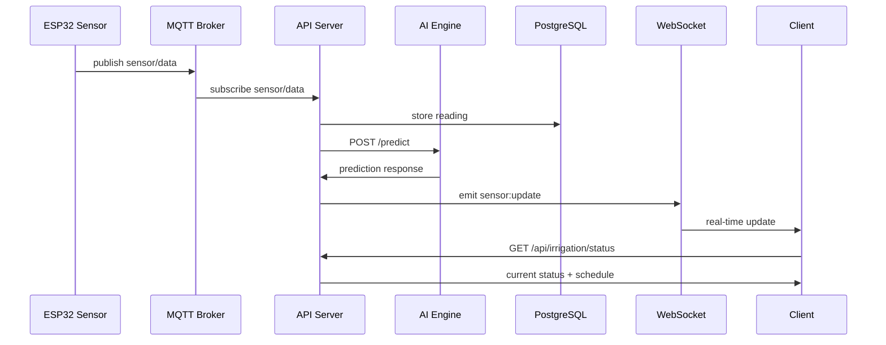

# System Architecture

## Overview

Hydro-Orbit follows a **microservices architecture** composed of five main components:

1. **ESP32 Firmware** — Collects sensor data and controls irrigation valves
2. **API Server** — Express backend handling auth, data persistence, and WebSocket events
3. **AI Engine** — Python FastAPI service providing irrigation predictions
4. **Web Dashboard** — React + Vite frontend for desktop monitoring and control
5. **Mobile App** — React Native (Expo) app for on-the-go access

## Data Flow

## Communication Protocols

| Protocol | Usage | Port |
|----------|-------|------|
| HTTP/REST | API requests (CRUD operations) | 3000 |
| WebSocket | Real-time updates (sensor data, alerts) | 3000 |
| MQTT | Device-to-server messaging | 1883 |
| TCP | AI engine internal API | 8000 |

## Component Details

### ESP32 Firmware (`firmware/`)

- Measures soil moisture (capacitive sensor), pH, water level, battery voltage
- Publishes JSON readings to MQTT every 30 seconds
- Listens for irrigation commands via MQTT
- Runs local fuzzy logic as fallback for autonomous operation
- Deep-sleep between readings (~2W average power)

### API Server (`apps/api/`)

- Express 4 with TypeScript
- Prisma ORM with PostgreSQL
- Redis for caching and session management
- Socket.IO for WebSocket connections
- JWT authentication with role-based access (farmer/admin)
- Rate limiting (100 requests per 15 minutes)
- Winston logging

### AI Engine (`ai-engine/`)

- FastAPI Python service
- Endpoints: `/predict` (irrigation recommendation), `/train` (model training)
- Fuzzy logic inference for rule-based decisions
- LSTM neural network placeholder for time-series prediction
- Inputs: soil moisture history, weather forecast, zone properties

### Web Dashboard (`apps/web/`)

- React 18 with Vite 5
- Tailwind CSS 3 with custom emerald theme
- React Router 6 for navigation
- Zustand for state management
- TanStack React Query for server state
- Socket.IO client for real-time updates
- Responsive layout with collapsible sidebar

### Mobile App (`apps/mobile/`)

- React Native 0.72 with Expo 49
- React Navigation 6 (stack + bottom tabs)
- Same Zustand stores as web (code sharing)
- Same API hooks pattern as web
- Offline-capable with local storage

## Database Schema

6 enums and 8 models covering users, farms, zones, sensors, readings, irrigation events, alerts, and schedules. See `apps/api/prisma/schema.prisma` for the full schema.

## Security

- JWT tokens with configurable expiration
- Passwords hashed with bcrypt
- Role-based middleware (`requireRole`)
- Helmet security headers
- CORS restricted to configured frontend URLs
- Rate limiting on all API routes
- Environment-based secret management
